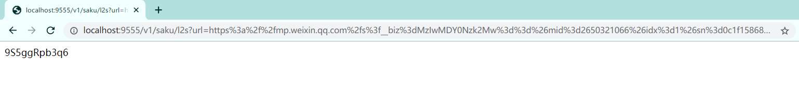
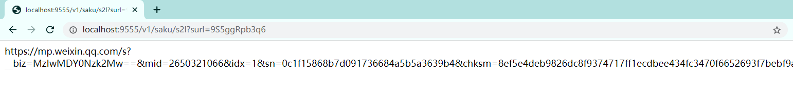

[](http://www.apache.org/licenses/LICENSE-2.0)

# Saku 

> **Saku**一个高性能的短链服务


:mask:疫情无情，人有情，来了就**Star**:star:一下吧 :point_up:


## 整体设计


- 1、解决内容中url太长影响阅读体验和内容质量
- 2、短链容易转换（二维码）、传播分享
- 3、长链第三方无法识别（微信、钉钉）

### 短链请求过程&原理


## Features

- 支持MurmurHash/DB Auto Incr 高性能生成短链

## Quick Start

* git clone

- 配置

  ```yml
  saku:
    type: hash # 默认hash（基于Murmurhash）,可选dbincr（数据库自增）
  
  spring:
    datasource:
      url: jdbc:postgresql://postgres.host:5432/xxx
      username: postgres
      password: postgres
      driver-class-name: org.postgresql.Driver
  
  # 服务启动的端口
  server:
    port: 9555
  
  ```

- 启动服务

- 生成短链 /v1/saku/12s

  

  

  - GET Request

    ```url
    http://localhost:9555/v1/saku/l2s?url=https%3a%2f%2fmp.weixin.qq.com%2fs%3f__biz%3dMzIwMDY0Nzk2Mw%3d%3d%26mid%3d2650321066%26idx%3d1%26sn%3d0c1f15868b7d091736684a5b5a3639b4%26chksm%3d8ef5e4deb9826dc8f9374717ff1ecdbee434fc3470f6652693f7bebf9a58491a2ca8b381a57d%26scene%3d21%23wechat_redirect
    ```

  - return

    ```url
    9S5ggRpb3q6
    ```

​    

- 使用短链换取原URL:/v1/saku/s2l

  

  - GET Request

    ```url
    http://localhost:9555/v1/saku/s2l?surl=9S5ggRpb3q6
    ```

  - return

    ```url
    https://mp.weixin.qq.com/s?__biz=MzIwMDY0Nzk2Mw==&mid=2650321066&idx=1&sn=0c1f15868b7d091736684a5b5a3639b4&chksm=8ef5e4deb9826dc8f9374717ff1ecdbee434fc3470f6652693f7bebf9a58491a2ca8b381a57d&scene=21#wechat_redirect
    ```

    

  


## TODO

1. 去重过滤（目前主要考虑没有重复的场景，如果有大量相同的短链生成请求，数据库自增的方式会冗余大量数据）
2. 提供压测数据
3. 支持多种数据库（mysql 、Oracle）


## Feedback

 [gshiwen@gmail.com](mailto:gshiwen@gmail.com)

## License

[Apache License 2.0](LICENSE)


